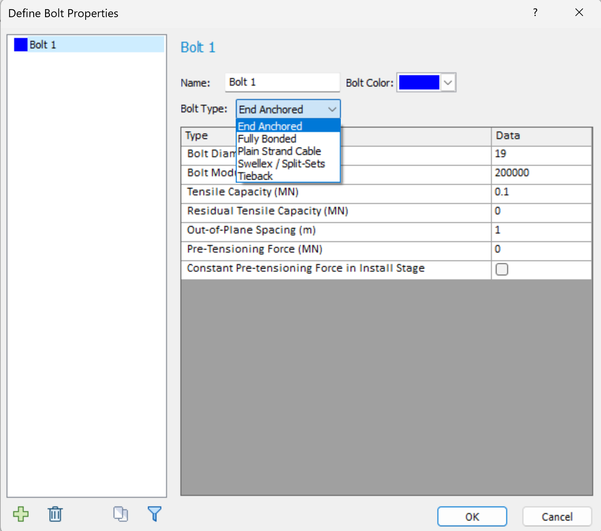
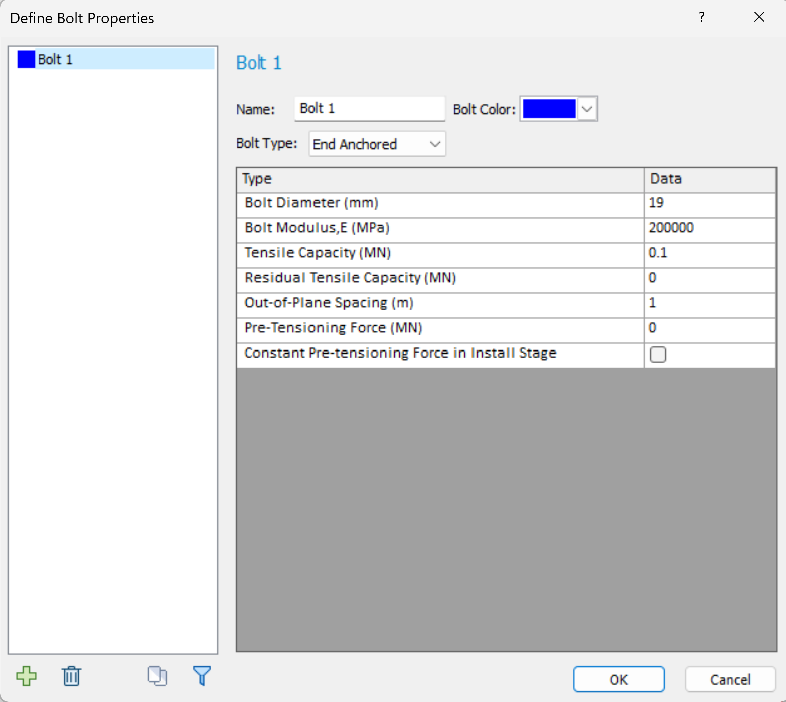

rs2.modeler.properties.bolt package
===================================

Bolt package provides users a full access to setting bolt properties based on the bolt type.

   RS2 modeler bolt type

   RS2 modeler bolt properties

.. toctree::
   :maxdepth: 1

   rs2.modeler.properties.bolt.Bolt
   rs2.modeler.properties.bolt.EndAnchored
   rs2.modeler.properties.bolt.FullyBonded
   rs2.modeler.properties.bolt.PlainStrandCable
   rs2.modeler.properties.bolt.Swellex
   rs2.modeler.properties.bolt.Tieback

.. automodule:: rs2.modeler.properties.bolt
   :members:
   :undoc-members:
   :show-inheritance:
