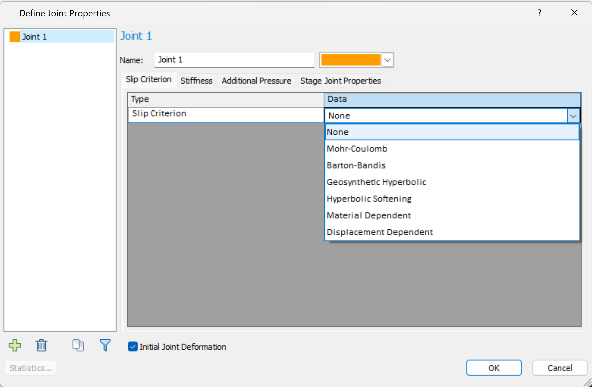

rs2.modeler.properties.joint package
====================================

Joint package provides users a full access to setting joint properties based on the joint type.

   RS2 modeler joint properties

.. toctree::
   :maxdepth: 1

   rs2.modeler.properties.joint.BartonBandis
   rs2.modeler.properties.joint.BartonBandisMaterial
   rs2.modeler.properties.joint.DisplacementDependent
   rs2.modeler.properties.joint.GeosyntheticHyperbolic
   rs2.modeler.properties.joint.GeosyntheticHyperbolicMaterial
   rs2.modeler.properties.joint.HyperbolicSoftening
   rs2.modeler.properties.joint.Joint
   rs2.modeler.properties.joint.MaterialDependent
   rs2.modeler.properties.joint.MohrCoulomb
   rs2.modeler.properties.joint.MohrCoulombMaterial
   rs2.modeler.properties.joint.NoneSlip

.. automodule:: rs2.modeler.properties.joint
   :members:
   :undoc-members:
   :show-inheritance:
