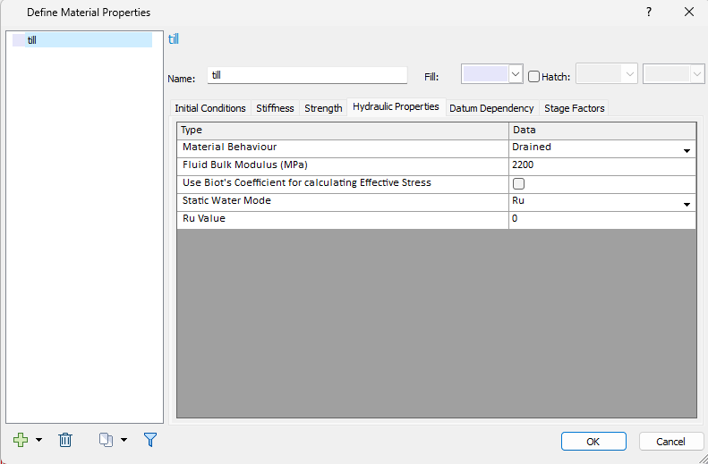

rs2.modeler.properties.material.hydraulic package
=================================================

Material hydraulic properties can be defined here.
	

	RS2 material properties
	

.. toctree::
   :maxdepth: 2

   rs2.modeler.properties.material.hydraulic.FEAGroundwater

.. toctree::
   :maxdepth: 1

   rs2.modeler.properties.material.hydraulic.Hydraulic
   rs2.modeler.properties.material.hydraulic.StaticGroundwater

.. automodule:: rs2.modeler.properties.material.hydraulic
   :members:
   :undoc-members:
   :show-inheritance:
