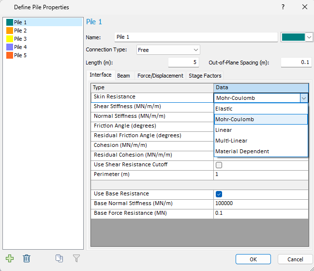

rs2.modeler.properties.pile package
===================================

Pile package provides users a full access to setting pile properties.

   RS2 modeler pile properties

.. toctree::
   :maxdepth: 1

   rs2.modeler.properties.pile.Beam
   rs2.modeler.properties.pile.Elastic
   rs2.modeler.properties.pile.ForceDisplacement
   rs2.modeler.properties.pile.Linear
   rs2.modeler.properties.pile.MaterialDependentPile
   rs2.modeler.properties.pile.MohrCoulombPile
   rs2.modeler.properties.pile.MultiLinear
   rs2.modeler.properties.pile.Pile

.. automodule:: rs2.modeler.properties.pile
   :members:
   :undoc-members:
   :show-inheritance:
