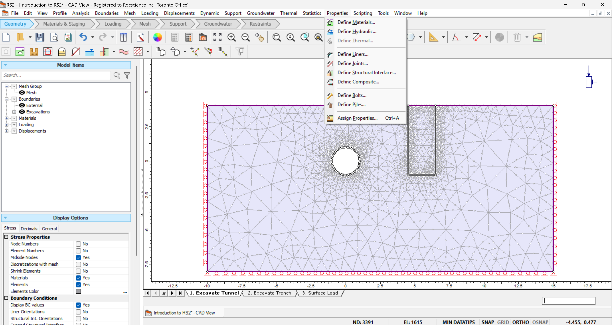

rs2.modeler.properties package
==============================

RS2 modeler properties package corresponding to "Properties" tab in RS2.

   RS2 modeler properties

.. toctree::
   :maxdepth: 2

   rs2.modeler.properties.bolt
   rs2.modeler.properties.joint
   rs2.modeler.properties.liner
   rs2.modeler.properties.material
   rs2.modeler.properties.pile

.. toctree::
   :maxdepth: 1

   rs2.modeler.properties.AbsoluteStageFactorGettersInterface
   rs2.modeler.properties.AbsoluteStageFactorInterface
   rs2.modeler.properties.CompositeProperty
   rs2.modeler.properties.DiscreteFunction
   rs2.modeler.properties.MaterialJoint
   rs2.modeler.properties.MaterialJointOptions
   rs2.modeler.properties.PropertyEnums
   rs2.modeler.properties.RelativeStageFactorInterface
   rs2.modeler.properties.ShearNormalFunction
   rs2.modeler.properties.SnowdenAnisotropicFunction
   rs2.modeler.properties.StructuralInterface
   rs2.modeler.properties.UserDefinedWaterMode
   rs2.modeler.properties.propertyProxy

.. automodule:: rs2.modeler.properties
   :members:
   :undoc-members:
   :show-inheritance:
