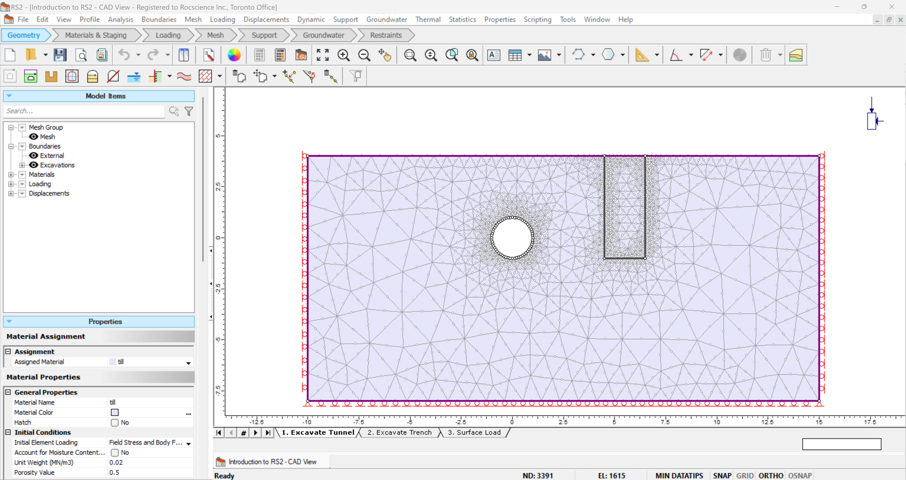
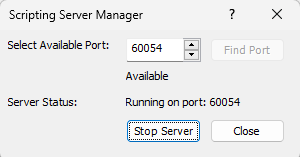

rs2.modeler package
===================

RS2 modeler package provides the same access to various functions that RS2 can provide. Model properties can be 
easily get and set through RS2 scriping.

	RS2 modeler

To use the RS2 modeler, scripting server need to be connected in RS2 modeler through Scripting > 
Manage Scripting Server > Select Available Port > Start Server. 

	RS2 modeler server

.. toctree::
   :maxdepth: 2

   rs2.modeler.properties

.. toctree::
   :maxdepth: 1

   rs2.modeler.Model
   rs2.modeler.RS2Modeler

.. automodule:: rs2.modeler
   :members:
   :undoc-members:
   :show-inheritance:
