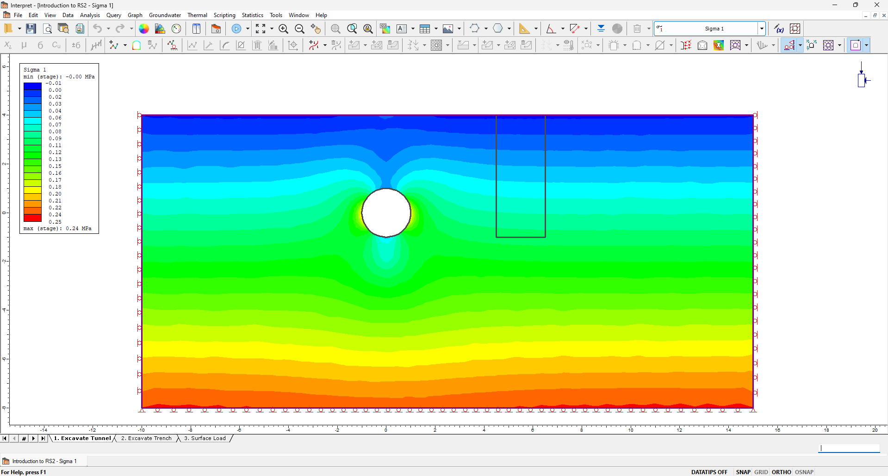

RS2 package
===========

RS2 contains modeler and interpreter. These two functions are separated as modeler package and interpreter package 
in RS2 scripting.

.. figure:: ../pictures/modeler.png

   RS2 modeler

   RS2 interpreter

.. toctree::
   :maxdepth: 2

   rs2.modeler
   rs2.interpreter
   rs2.utilities

.. toctree::
   :maxdepth: 1

   rs2.BaseModel
   rs2.Units

.. automodule:: rs2
   :members:
   :undoc-members:
   :show-inheritance:
